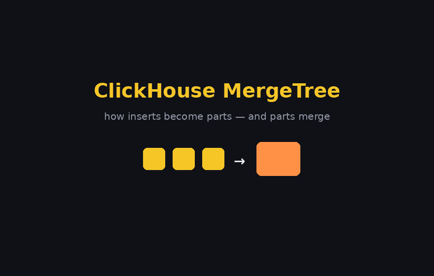

+++
title = 'ClickHouse MergeTree: Parts, Merges, and the Meaning of "Primary Key"'
date = 2026-07-13T15:06:44+08:00
slug = "clickhouse-mergetree-parts-merges-and-the-meaning-of-primary-key"
+++

. 
A walk from the storage engine up to the vocabulary. The throughline: almost every surprising thing about ClickHouse — why it batches inserts, why dedup is eventual, why a skip index can't save a bad key, why "primary key" doesn't mean what a Postgres user thinks — falls out of one design choice: **data lives as immutable, sorted parts that merge in the background.** Get that, and the rest is consequence.

---

## What ClickHouse Is

ClickHouse is an open-source, column-oriented database built for OLAP — scanning and aggregating billions of rows in milliseconds to low seconds. Data is stored by column (so a query reads only the columns it touches, and similar values compress hard), executed in vectorized blocks (SIMD-friendly, conceptually the same shape as Polars/DataFusion over Arrow batches), and distributed shared-nothing with replication coordinated by Keeper, its Raft-based ZooKeeper replacement.

Against BigQuery, the mental model is: BQ is a fully-managed serverless warehouse where storage and compute are decoupled and someone else runs everything; ClickHouse is a specialized columnar engine you operate yourself (or via ClickHouse Cloud), trading that operational burden for very low latency at high concurrency and real-time ingest. It's OLAP-first — weaker on frequent updates/deletes, heavy multi-table joins, and transactional guarantees.

The heart of it all is the **MergeTree** engine family.

---

## The Storage Hierarchy: Partition → Part → Granule

These three levels get conflated constantly, and keeping them straight resolves most confusion. Note especially: **the 8,192 figure is the *granule*, not the part.** A part can hold millions of rows.

- **Partition** — a *logical* group of parts sharing a `PARTITION BY` value (e.g. one month). Coarse; mostly a data-lifecycle tool (drop/TTL old partitions). Merges never cross a partition boundary. Over-partitioning is an anti-pattern — don't partition by anything high-cardinality.
- **Part** — a *directory on disk*: one compressed file per column, marks files mapping granules to byte offsets, the sparse `primary.idx`, checksums, and a minmax index for partition pruning. This is the unit that gets merged. One partition typically holds many parts.
- **Granule** — ~8,192 rows *inside* a part (`index_granularity`); the unit the sparse index points at and the smallest block read off disk. One part contains many granules.

So: one partition → many parts → each part → many granules.

> [!info] The 8,192 clarification
> `index_granularity = 8192` is the number of rows **between marks in the sparse index**, i.e. the granule size — not a limit on part size. The sparse "primary index" stores one entry per granule (the key-tuple values at its boundary), so the index for a billion-row table is a few MB and lives in RAM.

---

## Parts and the MergeTree Lifecycle

Every `INSERT` writes a new **immutable** part, its rows sorted by the table's `ORDER BY` key, at merge level 0. Background threads then continually merge small parts into larger ones, LSM-style. This is exactly why ClickHouse wants *batched* inserts (thousands of rows, or `async_insert`) — row-at-a-time writes cause a part explosion.

The part name encodes lineage: `partition_minBlock_maxBlock_level`. Each insert takes the next block number at level 0; merging the parts covering blocks 1–3 produces `all_1_3_1`. (Mutations append a mutation version.) Small parts are written **compact** (all columns in one file) and flip to **wide** (file-per-column) past a size threshold, usually at their first merge.

The animation below shows the whole cycle — inserts landing as level-0 parts, the scheduler selecting neighbours, the k-way merge preserving sort order, old parts going inactive, and merges cascading upward:


Mechanically a merge is a **k-way merge of already-sorted streams**: sequential reads, one sequential write, `ORDER BY` preserved, data recompressed into larger and better-compressing blocks. It's also the hook where engine semantics run — `ReplacingMergeTree` keeps the newest row per key, `Summing`/`AggregatingMergeTree` fold or aggregate, `CollapsingMergeTree` cancels ±1 sign pairs, TTL rules drop rows or move parts across storage tiers, and lightweight-delete masks get physically applied.

> [!warning] Merge semantics are *eventual*
> Merges are asynchronous and never guaranteed complete, so dedup/aggregation is eventual. At query time you either pay for `FINAL`, use `argMax`/`GROUP BY` patterns, or force `OPTIMIZE TABLE … FINAL` (expensive — it rewrites everything). Under replication the merge is logged through Keeper: one replica executes it, the others fetch the resulting part.

---

## How Merges Choose Which Parts to Combine

Partition is the *filter*, not the whole answer. Selection needs **two conditions together**:

1. **Same partition** — merges never cross a `PARTITION BY` boundary.
2. **Contiguous in the block-number sequence** — every active part covers a non-overlapping `minBlock_maxBlock` range, and these ranges are totally ordered. "Adjacent" means neighbouring in that ordering, with no active part in between. You can merge `all_1_3` + `all_4_6` (they touch), but not `all_1_3` + `all_7_9` while `all_4_6` still sits between them.

On top of that the scheduler adds a **desirability heuristic**: it prefers parts of *similar size* (to limit write amplification) and caps the merged result (roughly 150 GB by default), above which parts are left alone. So it isn't strictly left-to-right — it picks the cheapest contiguous run of similar-sized neighbours.

Why contiguity is required: keeping merges to adjacent block ranges means the result still covers one clean interval, so parts always **tile the block space without overlap**. That's the invariant the whole engine leans on — an ordered set of non-overlapping sorted runs. Push inserts faster than merging can keep up and you hit **"Too many parts"** backpressure (delayed inserts, then rejections) — the real engineering reason behind batching.

---

## The Sort Key: `ORDER BY`

Within every part, rows are physically sorted by the **full tuple** of `ORDER BY` columns, lexicographically — first column, then ties broken by the second, then the third. Same as a multi-level spreadsheet sort. With `ORDER BY (tenant, device_id, ts)`:

```
tenant  device_id  ts
A       d1         09:00
A       d1         09:05    ← same tenant+device → ordered by ts
A       d2         08:55    ← device_id breaks the tie *before* ts matters
A       d2         09:10
B       d1         08:00    ← new tenant starts a fresh ordering
```

`A/d2/08:55` sits below `A/d1/09:05` despite the earlier timestamp, because `device_id` is compared first. It's **one sorted run over the tuple**, not separate per-column sorts — which is exactly what makes merges the cheap k-way interleave shown above.

**The prefix rule.** Primary-index pruning only works on a *leading prefix* of the key. With `ORDER BY (tenant, ts)`: filtering on `tenant`, or `tenant AND ts`, prunes granules; filtering on `ts` alone does not (you'd need a skip index or a projection). So **column order is the real decision** — put the column you filter on most first. General guidance: **low cardinality before high cardinality**, so sorted runs stay long, the exclusion search stays effective, and compression improves. For time-series the timestamp usually goes last. (Exception: heavily repeated attributes like clickstream can justify leading with a higher-cardinality column purely for compression/locality.)

---

## `ORDER BY` vs `PRIMARY KEY` — the Decoupling Lever

By default `PRIMARY KEY` equals `ORDER BY` and the distinction is invisible. But they can differ, with one constraint: **`PRIMARY KEY` must be a prefix of `ORDER BY`.** This separates two jobs that otherwise get fused:

- `ORDER BY` → how rows are **physically sorted** (drives compression + range locality).
- `PRIMARY KEY` → which columns are **materialized into the in-memory sparse index**.

```sql
ORDER BY    (tenant, device_id, ts)
PRIMARY KEY (tenant, device_id)
```

Data is sorted by all three; the index only carries the first two. Handy when a trailing high-cardinality column (a millisecond timestamp) would bloat the index without helping pruning. The governing fact: **extra columns in the primary key do not slow down `SELECT`, but a long primary key does hurt insert performance and memory** (each granule mark stores the full key tuple in RAM).

> [!tip] The lever BigQuery doesn't give you
> A long `ORDER BY` for sort locality and compression, carrying a short `PRIMARY KEY` prefix for a lean index — decoupling *how finely sorted* from *how big the index*. In BQ the clustering columns are unavoidably both the sort order and the pruning metadata; you can't split them.

---

## The BigQuery Analogy (and Where It Leaks)

The mapping is clean and worth internalising:

| BigQuery | ClickHouse | Shared behaviour |
|---|---|---|
| `CLUSTER BY` | `ORDER BY` | Compound, lexicographic, prefix rule (filter left-to-right) |
| Partitioning column | `PARTITION BY` | Coarse pruning dimension |
| Automatic re-clustering | Background merges | A free background process that repairs sort order after writes |

Both cluster keys sort data so filtered scans skip storage units; both degrade as new data arrives and are repaired automatically. But three real divergences:

**1. Column limit.** BigQuery hard-caps clustering at **4 columns** (top-level, non-repeated, of a supported type). ClickHouse has **no explicit limit** — practically 3–5 is the sweet spot; the creator has mentioned seeing ~20 in a `SummingMergeTree` case but doesn't recommend it. The cap difference traces straight to the sparse index: in ClickHouse the ceiling is a soft insert-cost/memory tradeoff, not a schema rule.

**2. Index exposure.** ClickHouse's `ORDER BY` doubles as the sparse **primary index** you can reason about and tune; BQ clustering exposes no user-visible index, just block-level min/max metadata.

> [!warning] Gotcha when porting BQ intuition — cardinality inverts
> BigQuery clustering is happy leading with **high-cardinality** columns (and even benefits from them). ClickHouse wants **low-cardinality columns first** — better generic-exclusion search and better compression — with the high-cardinality column (usually the timestamp) trailing. Copying a BQ `CLUSTER BY` order directly into a ClickHouse `ORDER BY` can quietly kill pruning.

---

## Why It's Called "Primary Key"

The term has two independent lineages that merely share the word *primary*, and ClickHouse uses the older, storage-layer one:

- **Relational (Codd, 1970):** a *logical constraint* — a candidate key guaranteeing row uniqueness and identity. The meaning most people carry.
- **Physical storage:** the *primary index* — the principal index dictating how rows are laid out on disk, i.e. a **clustered index**. "Primary" here means *first-order / principal*, as opposed to **secondary** indexes.

ClickHouse means the second, and its own taxonomy makes that explicit: the sparse mark index built from `PRIMARY KEY` is the **primary index**, while minmax / `set` / bloom-filter skip indexes are literally the **secondary indexes**. So `PRIMARY KEY` names "the key backing the primary index" — primary *as opposed to secondary*, nothing to do with uniqueness.

It isn't a rogue choice: **InnoDB and SQL Server already overload the term the same way** — there the primary key *is* the clustered index and sets physical row order. ClickHouse kept that half (organise and sort the data) and dropped the other half (enforce uniqueness). It dropped uniqueness deliberately: a uniqueness check means a **read on every insert**, incompatible with cheap, batched, append-only writes into immutable sorted parts. Arguably ClickHouse uses "primary" *more* literally than a typical RDBMS — the first-order key by which data is primarily arranged. It only feels wrong because OLTP made the constraint meaning dominant.

> [!note] Not a uniqueness constraint
> ClickHouse's `PRIMARY KEY` enforces nothing about uniqueness or non-null. It's the organising/index key — closer to a SQL Server clustered index than to a relational primary key. This is also *why* it maps onto BQ's clustering key rather than onto the RDBMS notion.

---

## Primary vs Secondary Indexes — a Strict Hierarchy

This axis (principal vs auxiliary) is the whole logic, and it's load-bearing, not cosmetic:

- **The primary index *is* the data.** It's the sort order rows physically live in — not a separate structure pointing at rows, just marks describing where you already are in the sorted stream. Exactly one exists (you can't sort a deck two ways at once). Zero redundancy.
- **Secondary (skip) indexes are auxiliary metadata *about* blocks** — per-granule minmax, `set`, bloom filters. They reorder nothing; they let you skip granules the primary order didn't already cluster for you. Optional, many allowed, and they only help when the indexed column **correlates with the primary order** — otherwise the values are smeared across granules and the index prunes nothing while still adding overhead.

The crux: **a secondary index cannot rescue a bad primary-key choice**, because it rides on top of the physical layout the primary key already dictated. This is the opposite of a row-store like Postgres, where an independent secondary B-tree can rescue almost any query with its own sorted pointer structure. In a columnar sorted-parts world the primary key is *genuinely* primary — everything else refines it, never replaces it.

Hence the escalation ladder:

1. **Get `ORDER BY` right first.** It's the single highest-leverage schema decision.
2. **Reach for projections** — essentially a second physical copy of the data sorted differently, maintained on insert. The real escape hatch when you need a genuinely different access path.
3. **Skip indexes last** — a correlated tie-breaker, not a rescue.

---

## Key Takeaways

- **Immutable sorted parts + background merges** is the one idea everything else derives from.
- **Partition ⊃ Part ⊃ Granule.** 8,192 rows is the *granule* (the sparse-index stride), not the part.
- **Batch your inserts** — row-at-a-time causes part explosion and "Too many parts" backpressure.
- **Merge selection = same partition + block-range contiguity + size-similarity**, capped ~150 GB. Contiguity keeps parts tiling the block space with no overlap.
- **Merge-time semantics (Replacing/Summing/Aggregating/TTL) are eventual** — use `FINAL` or `argMax`/`GROUP BY` at read time.
- **`ORDER BY` is a compound lexicographic sort; pruning needs a leading prefix.** Column order is the real decision; low-cardinality generally goes first.
- **Split `ORDER BY` (long, for sort/compression) from `PRIMARY KEY` (short, for a lean index)** — a lever BQ lacks. Extra key columns don't slow `SELECT`, only inserts/memory.
- **BQ `CLUSTER BY` ≈ CH `ORDER BY`**, but: BQ caps at 4 columns / CH has no limit; CH exposes the sparse index; **cardinality ordering inverts**.
- **"Primary key" = primary *index* (clustered), not a uniqueness constraint** — primary as opposed to secondary. Uniqueness was dropped because it needs a read per insert.
- **A skip index can't fix a bad `ORDER BY`.** Escalate: `ORDER BY` → projections → skip indexes.

---

## References

- [MergeTree table engine — ClickHouse Docs](https://clickhouse.com/docs/engines/table-engines/mergetree-family/mergetree)
- [The definitive guide to ClickHouse query optimization](https://clickhouse.com/resources/engineering/clickhouse-query-optimisation-definitive-guide)
- [Picking ORDER BY / PRIMARY KEY / PARTITION BY — Altinity KB](https://kb.altinity.com/engines/mergetree-table-engine-family/pick-keys/)
- [Introduction to clustered tables — BigQuery Docs](https://cloud.google.com/bigquery/docs/clustered-tables)
- [Create clustered tables — BigQuery Docs](https://cloud.google.com/bigquery/docs/creating-clustered-tables)
