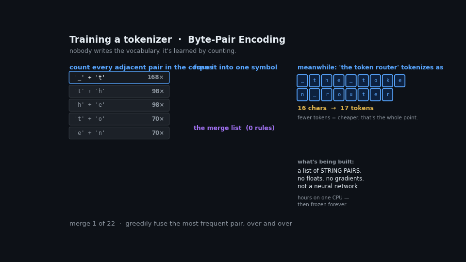
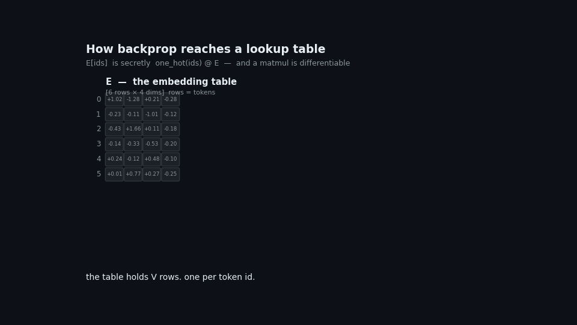
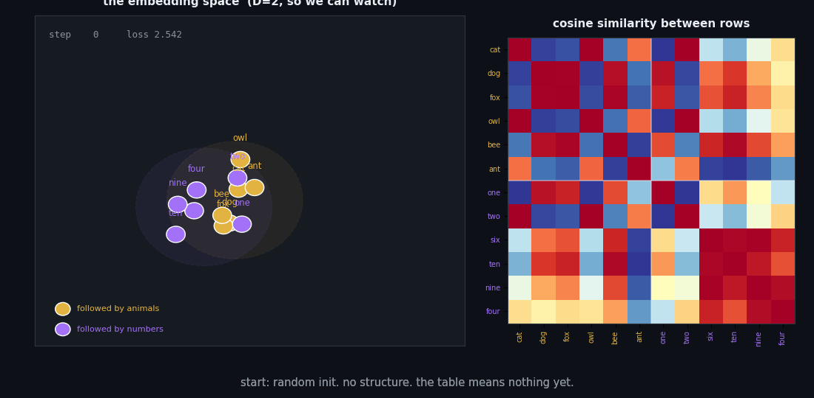

+++
title = "From Text to Vectors: How an Embedding Table Actually Gets Trained"
date = 2026-07-15T00:00:00+08:00
slug = "embedding-table"

[taxonomies]
tags = ["llm", "embeddings", "tokenization", "backpropagation", "transformers"]
+++

There's a seam running through every language model that almost nobody looks at directly. Above it, a trillion floats learned by gradient descent. Below it, a text file full of strings that was frozen before training began and can never change again.

That seam is where text becomes numbers. This is a walk through it, in three parts: how the tokenizer gets built, why backpropagation can reach a lookup table at all, and what the embedding actually learns once it can.

The thing I want to dislodge along the way is a specific and very common intuition — that an "embedding model" is a component you can swap. In a RAG stack, it is. Inside an LLM, it isn't, and understanding why turns out to explain most of the rest.

---

## Part 1: The tokenizer is not a neural network



Start with the thing everyone skips.

A tokenizer is trained, but not the way a model is trained. There are no gradients involved. There is no loss function. The algorithm — Byte-Pair Encoding — is almost embarrassingly simple:

1. Break every word into characters.
2. Count every adjacent pair across the corpus.
3. Fuse the most frequent pair into a single symbol.
4. Repeat, tens of thousands of times.

That's it. Run it on a corpus about routing tokens to experts and watch what it discovers:

```
merge   0: '_' + 't'    -> '_t'      (seen 204x)
merge   1: '_t' + 'h'   -> '_th'     (seen 132x)
merge   2: '_th' + 'e'  -> '_the'    (seen 132x)
...
merge  20: '_toke' + 'n' -> '_token' (seen 48x)
```

It learned that `_the` and `_token` are units. Not because anyone told it about English, and not because it understands anything — purely because those character sequences kept showing up next to each other. Frequency is the entire mechanism.

**The artifact this produces is a text file.** Here is the whole thing:

```json
{
  "vocab":  {"_the": 24, "_token": 41, "_experts": 52, ...},
  "merges": ["_ t", "_t h", "_th e", "_t o", ...]
}
```

Strings and integers. Zero floats. Nothing in there could be a weight. You can open a real `tokenizer.json` in a text editor and read it end to end.

This matters because of what it implies about cost and sequence. BPE training is hours on a single CPU box. It happens *before* the model exists, and once it finishes, it is frozen — permanently, structurally, for the life of the model.

### What the tokenizer is actually for

The compression is the point:

```
'the model routes the token'  →  26 chars  →   5 tokens
'xylophone'                   →   9 chars  →  10 tokens
```

Common text collapses. Unfamiliar text shatters back into small pieces — ultimately into raw bytes, of which there are only 256, all guaranteed present in the vocabulary. **A tokenizer cannot fail.** It can only get expensive.

That "cannot fail" property is doing more work than it appears. It's what lets a fixed-size table handle unbounded input. The tokenizer is a *discretizer*: it grinds arbitrary text down into a finite alphabet, so that the thing downstream only ever has to handle one of `V` known cases.

Every tokenizer quirk you've heard about traces back to this stage. Bad arithmetic because numbers split inconsistently. Non-English costing more tokens because the merges were learned from an English-heavy corpus. Trailing whitespace changing outputs. All of it is decided here, before the model sees a single training example, and none of it can be fixed afterward.

---

## Part 2: Why backprop can update a lookup table



Now the part that should bother you.

The embedding layer is `nn.Embedding(128256, 4096)` — a matrix with one row per token. Getting a token's vector means indexing a row:

```python
x = E[ids]     # ids = [15496, 995]
```

That's a lookup. It's not arithmetic. There's no function being computed. **So how does a gradient get into it?**

The answer is that a lookup is a matmul wearing a disguise:

```
E[ids]  ≡  one_hot(ids) @ E
```

Indexing row 15496 is *identical* to multiplying by a vector that's 1 at position 15496 and 0 everywhere else. Nobody computes it that way — multiplying against 128,255 zeros would be absurd — but mathematically that's what it is. And a matrix multiplication is differentiable with respect to its operands.

Work the backward pass through and you get:

```
dE = one_hot.T @ dx
```

which collapses to: *scatter `dx` back into the rows you used.* Two lines of numpy, and it's exact:

```python
grad_matmul  = onehot.T @ dx
grad_scatter = np.zeros_like(E)
np.add.at(grad_scatter, ids, dx)

np.allclose(grad_matmul, grad_scatter)   # True
```

So `E` gets gradients like any other parameter. Not from a special embedding objective — there isn't one. From the same next-token-prediction loss as everything else:

```
ONE loss: cross-entropy = 2.4876

  dE   norm = 0.02734    ← embedding
  dW1  norm = 0.03706    ← a layer
  dW2  norm = 0.03612    ← lm_head

after one step: loss 2.4876 → 2.4859   (all three moved together)
```

**There is no "embedding training" stage.** The table is trained jointly with every other weight, in the same backward pass, from the same loss. It's just rows 0 through V of one big blob.

This wasn't always true, which is where the confusion comes from. word2vec and GloVe, circa 2013, genuinely did train embeddings as standalone artifacts with their own objective, to be loaded into some downstream model later. That era ended when transformers replaced static per-word vectors with contextual ones and absorbed the input table into the model as ordinary weights. Your RAG embedder is the last surviving relative of that lineage — which is exactly why *it* is swappable and an LLM's table is not.

### The boundary

There's an asymmetry in that backward pass worth staring at:

```
loss → lm_head → blocks → embedding table    ✓  gradient flows here
                              ↓
                          token IDs           ✗  STOPS. no gradient.
```

Gradients reach the **table**, because it's a parameter. They never reach the **IDs**, because they're integers — discrete, not differentiable, and they're the *input*, which you don't train anyway.

**That's the edge of the neural network.** Everything above the line is learned. Everything below it is a frozen text file from a different training run, hours long, on a CPU. The tokenizer sits on the far side of a boundary gradients cannot cross, which is the real reason it can never change.

### The sparsity nobody mentions

One detail falls out of the scatter-add. Feed a batch of ids `[3, 7, 1, 7]` and look at the per-row gradient:

```
row  1: |grad| = 0.013655   ← used
row  3: |grad| = 0.013548   ← used
row  7: |grad| = 0.019422   ← used TWICE, double signal
rows 0,2,4,5,6,8,10,11: exactly 0.000000
```

Only rows whose tokens actually appeared get updated. Everything else receives precisely nothing.

Which means a token's vector is learned *only* from the contexts where it shows up. Rare tokens get few updates and end up sitting near their random initialization — undertrained rows in an otherwise trained model.

This is the mechanism behind **glitch tokens**. `SolidGoldMagikarp` and friends were strings that BPE carved out of the *tokenizer's* corpus, which then barely occurred in the *pretraining* corpus. They got a row. They never got a meaning. It's a rare case where a specific, nameable model failure traces directly to the seam between two training runs.

---

## Part 3: What the table learns



So the values are free to become anything. What do they become?

Here's a toy language with structure I never disclosed to the model. Twelve tokens: six animals, six numbers. Animals are always followed by animals, numbers by numbers. Train a two-dimensional embedding on next-token prediction and watch.

The points start scattered at random. Nothing means anything. Then, gradually, they sort themselves into two clusters — and the cosine similarity matrix develops two clean blocks on the diagonal.

```
avg cosine, animal ↔ animal : +0.180
avg cosine, number ↔ number : +0.235
avg cosine, animal ↔ number : -0.337
```

**It was never told there were two groups.** It discovered that tokens which *behave* alike should *sit* close together, because that's what made next-token prediction work. The grouping isn't an input. It's a consequence.

### Where the meaning lives

Check whether any individual dimension means something:

```
dim 0: animals avg -0.157 | numbers avg +0.207
dim 1: animals avg -0.375 | numbers avg +0.354
dim 2: animals avg +0.296 | numbers avg -0.305
```

No clean story. Dimensions aren't features you can name. `E[id][j]` is a coordinate — an unconstrained real number, frequently negative, that means nothing on its own.

**The knowledge is in the distances, not the cells.** That's what "distributed representation" means, stated precisely: no single number carries meaning; the arrangement does.

### What this rules out

Two conclusions follow, and they're the ones that kill the swap-the-embeddings idea for good.

The vectors have **no intrinsic meaning**. Row 15496 isn't "Hello" in some universal coordinate system. It's whatever arbitrary point in 4096-dim space *this particular model's layers co-evolved to interpret* as "Hello." The coordinate system is private to one network.

So dropping in a different table doesn't change behavior — it produces noise. Every downstream weight is reading a language it never learned. It's less like swapping a dictionary and more like rewiring which letters your keyboard emits, then wondering why your muscle memory outputs garbage.

And the sizes make the futility concrete. Llama-3's `tokenizer.json` is ~9 MB of strings; its embedding table is ~1,050 MB of floats. **117× bigger**, and every byte of it came from backprop.

---

## The shape/values distinction

If one thing from this is worth keeping, it's this.

**The tokenizer decides the shape. Backprop decides the values.** These don't conflict, and mixing them up is the source of most confusion here.

```python
nn.Embedding(128256, 4096)
             ^^^^^^  ^^^^
             tokenizer   your architecture choice
             (row count) (nothing to do with the tokenizer)
```

Note that the tokenizer only fixes `V`. The width is the architect's call, and the tokenizer has no opinion on it.

Train a model and watch both properties at once:

```
step   0: E.shape = (12, 8)   row7 = [-0.130 -0.221  0.075  0.309]
step 200: E.shape = (12, 8)   row7 = [-0.474 -0.163 -0.279 -0.402]
step 600: E.shape = (12, 8)   row7 = [-0.540 -0.148 -0.300 -0.423]

shape : never changed
row 7 : moved by 1.5034
```

| | set by | changes during training? |
|---|---|---|
| row count `V` | tokenizer | **never** |
| width `D` | architect | **never** |
| the `V×D` floats | **backprop** | **every step** |

Think of it as a filing cabinet with 128,256 labeled drawers. The labels are printed permanently — drawer 41 says `_token` and always will. What goes *inside* drawer 41 is entirely up to training. "Limited by the tokenizer" is true of the cabinet, not the contents.

---

## What you can actually do

The instinct to intervene at the embedding layer isn't wrong. It's just aimed at the wrong operation. You can't *substitute* the table, but you can *add to* it:

**Soft prompts.** Prepend learned continuous vectors to your prompt's embedding sequence. They correspond to no token. Freeze the whole model, train only those few vectors. This genuinely steers behavior for a few thousand parameters.

The space makes this possible in a way that's worth appreciating. You can't interpolate the inputs — there is no token between 3 and 4, and `E[3.5]` is a `TypeError`. But you can average the *outputs*:

```
0.5*E[3] + 0.5*E[4]  →  a perfectly valid point in R^D
                         corresponding to no token at all
```

The space is continuous and dense. Only `V` of its points have names. **Everything else is reachable — you just can't get there by typing.** That's the entire idea behind soft prompting.

**Vocabulary extension.** Adding tokens for a new language or domain jargon means resizing the table and training the new rows while old ones stay put. Standard practice when adapting a base model.

**Steering vectors.** Add a direction to the residual stream. Usually applied at a middle layer rather than the input, since concepts are more linearly represented there.

The pattern: extend and steer, don't substitute. Meaning lives in the relationship between the table and the layers above it — never in the table alone.

---

## The whole chain

```
raw text
  ↓  tokenizer          frozen text file. no floats. hours on a CPU.
token ids                ← gradients stop here. edge of the network.
  ↓  E[ids]             lookup ≡ one_hot @ E. differentiable w.r.t. E.
vectors                  learned coordinates. meaning is in the geometry.
  ↓  transformer blocks  attention mixes across tokens; FFN/MoE per token
  ↓  lm_head             often the SAME matrix as E, used backwards
softmax                  ← NOW you have probabilities over token ids
  ↓
next token
```

Two artifacts, two training runs, one seam. The tokenizer is a frozen text file with no floats in it. Everything downstream is one blob of weights learning from one loss — including the embedding, which is special only in that its backward pass is a scatter instead of a matmul.

Knowing where that seam runs explains a surprising amount: why tokenizer quirks are permanent, why glitch tokens exist, why RAG embedders are swappable and LLM tables aren't, and why soft prompts work at all.

---

## Notes

- Every number in this piece came from a script that ran. The demos are toys — twelve tokens, two dimensions — but the mechanisms are exact, not analogies.
- `E[3.5]` really does raise `TypeError`. The input space has no interior. That's the same fact as "gradients don't reach the ids," seen from the other side.
- Weight tying (`lm_head.weight = embed.weight`) means the same matrix is often used in both directions: as a lookup producing coordinates, and transposed to produce logits. Only the second direction yields anything resembling a probability.
