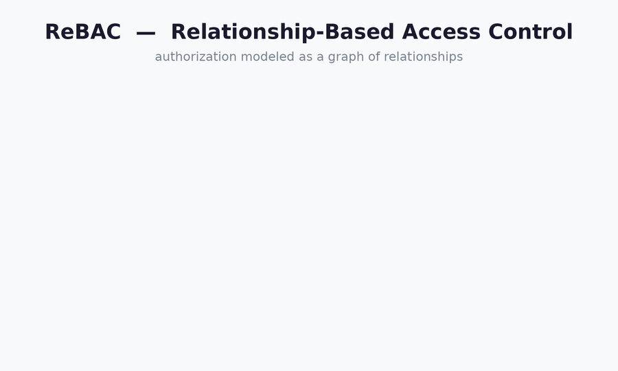

+++
title = "From RBAC to ABAC (to ReBAC): How Access Control Models Evolve"
date = 2026-07-11T05:45:12+08:00
slug = "from-rbac-to-abac-to-rebac-how-access-control-models-evolve"
+++


## The one insight that makes the whole migration make sense

A **role is just a special case of an attribute.**

In pure RBAC the authorization question is narrow: *"does this user hold a role that grants permission P?"* The role is an indirection layer — it bundles a set of permissions, and users acquire those permissions by being assigned roles (`user → role → permission`).

ABAC keeps that idea but widens the lens. Instead of looking only at *which roles you hold*, a policy can evaluate arbitrary attributes of four things:

- the **subject** — role, department, clearance, manager, employment status
- the **resource** — owner, classification, project, sensitivity tag
- the **action** — read / write / approve
- the **environment** — time of day, IP, device posture, MFA state

Under that framing, RBAC is simply the degenerate form of ABAC where the *only* attribute anyone ever inspects is `subject.role`. That is exactly why the transition is gradual rather than a rewrite: you don't throw roles away, you **demote them** from *being the entire model* to *being one attribute among many*.

## Why the pressure to migrate: role explosion

RBAC works beautifully until policies become *contextual*.

> "Editors can edit" — fine.
> "Editors can edit, but only documents in **their own** department, only during **business hours**, only if the doc **isn't confidential**" — no longer expressible with roles alone.

To force contextual rules into a role model you start minting combinatorial roles: `editor-marketing`, `editor-marketing-bizhours`, `editor-finance-nonconfidential`, and so on. The role count grows multiplicatively with every new condition. That blow-up — **role explosion** — is the classic thing that pushes teams toward attributes. *(Shown in the RBAC → ABAC animation below.)*

## The gradual path, in three steps

1. **Pure RBAC** — roles map directly to permissions.
2. **RBAC + attribute constraints** — keep roles as the coarse backbone, then layer attribute conditions on top: `role == editor AND resource.department == subject.department`. **Most production systems live here permanently.** AWS IAM is the canonical hybrid: roles and policies (the RBAC-ish part) plus condition keys and resource tags (the ABAC part).
3. **Full ABAC** — the role, if it survives at all, is just another attribute; all decision logic lives in policies evaluated at request time.

So the "replacement" is really the slow migration of decision logic **out of role definitions and into attribute-based policy rules** — rarely a big-bang cutover.


## Implementation: two genuinely different problems

### RBAC is a data-model problem

You have tables — `users`, `roles`, `permissions` — and the join tables `user_roles` and `role_permissions`. An access check is a set-membership test / JOIN: fast, cacheable, precomputable, and **static**. A pleasant side effect: the reverse question *"who can access resource X?"* is cheap, because you just walk the tables.

### ABAC is a policy-evaluation problem

The NIST reference model splits the system into four cooperating pieces:

| Component | Role |
|-----------|------|
| **PEP** — Policy Enforcement Point | sits in front of the resource, intercepts the request |
| **PDP** — Policy Decision Point | evaluates policies, returns allow / deny (sometimes with *obligations*, e.g. "allow but log") |
| **PIP** — Policy Information Point | supplies the attributes the PDP needs |
| **PAP** — Policy Administration Point | where policies are authored |

At request time you gather the attribute context, hand it to the PDP, and it runs the policies. The policy is a **boolean function over attributes**, not a table lookup. *(Shown in the second half of the RBAC → ABAC animation above.)*

Common policy languages:

- **XACML** — the original; XML; heavyweight.
- **Rego / Open Policy Agent (OPA)** — the popular modern choice, usually run as a sidecar PDP.
- **Cedar** — AWS's newer language, behind Verified Permissions.

**The tradeoff is real.** ABAC buys fine-grained, context-aware control without role explosion — but it costs you auditability and simplicity. *"Who can access this resource?"* becomes an expensive reverse query: there's no table holding the answer, so you may have to enumerate subjects and evaluate policies against each. Large policy sets are harder to test and reason about, and every attribute a policy needs must actually be *available* at request time (latency plus a PIP to source it).

## The third model hiding in the examples: ReBAC


Two very common "roles" aren't cleanly RBAC at all: **"project member"** and **"groups he belongs to."** These are inherently *relational* — they depend on the relationship between a *specific* user and a *specific* resource instance, not on a global role. Expressing them in ABAC is awkward (you carry a `subject.member_of` list and a `resource.project_id` and check for intersection).

That awkwardness is what **ReBAC — Relationship-Based Access Control** exists to solve. It models authorization as a **graph of relationships** and answers questions by **traversing** that graph:

```
user:edward  --member-of-->  project:foo  --owns-->  doc:bar
```

*"Can edward view doc:bar?"* becomes a reachability query over that graph. The canonical design is Google's **Zanzibar**; open implementations include **SpiceDB**, **OpenFGA**, and **Ory Keto**. If a lot of your rules take the shape *"X is a member / owner / parent of Y,"* ReBAC often fits better than either RBAC or ABAC.


---

## One rule, three models

To make the differences concrete, here is a single rule expressed in each model:

> **A user can edit a document if they're an editor, the doc is in their own department, and it's business hours.**

### RBAC — can't express it without leaking logic into code

A role is a static, global bundle — blind to the *specific* resource and to the environment. So you either explode the roles, or you keep a clean `editor` role and push the contextual checks into application code:

```python
if user.has_role("editor") \
   and doc.department == user.department \
   and 9 <= now().hour < 18:
    allow()
```

Notice what happened: the moment a real rule appeared, **two-thirds of the logic leaked out of RBAC** into hand-written `if` statements scattered across the codebase. That leakage *is* the argument for ABAC — you're already doing attribute-based access control, just informally.

### ABAC — the whole rule is one policy

**Rego (Open Policy Agent):**

```rego
package authz

default allow = false

allow {
    input.action == "edit"
    input.subject.role == "editor"
    input.resource.department == input.subject.department
    input.time.hour >= 9
    input.time.hour < 18
}
```

The request handed to the PDP carries the full context:

```json
{
  "subject":  { "role": "editor", "department": "marketing" },
  "action":   "edit",
  "resource": { "id": "doc:42", "department": "marketing" },
  "time":     { "hour": 14 }
}
```

**Cedar (AWS)** — more structured about the principal / action / resource triple:

```cedar
permit (
    principal,
    action == Action::"edit",
    resource
)
when {
    principal.role == "editor" &&
    resource.department == principal.department &&
    context.hour >= 9 && context.hour < 18
};
```

All three conditions — role, ownership, time — live in one declarative place. Adding a fourth ("…and the doc isn't classified") is a one-line edit, not a new role.

### ReBAC — "own department" becomes an edge, not a comparison

**SpiceDB / OpenFGA-style schema:**

```
definition user {}

definition department {
    relation editor: user
}

definition document {
    relation dept: department
    permission edit = dept->editor
}
```

**Relationship tuples** (the facts that populate the graph):

```
department:marketing#editor@user:edward
document:doc42#dept@department:marketing
```

The check `document:doc42#edit@user:edward` returns **true** by traversal: doc42's `dept` is `marketing`, edward is an `editor` of `marketing`, so `edit` is granted. There's no *"does edward's department equal the doc's department"* comparison anywhere — the **relationship replaces the attribute match.**

**But note what's missing: business hours.** Time-of-day is a pure environmental attribute — it isn't a relationship between two entities, so it has no natural home in a relationship graph. This is ReBAC's genuine weak spot, and systems bolt it on with a side mechanism — SpiceDB calls them **caveats**, OpenFGA calls them **conditions**:

```
caveat business_hours(now int) {
    now >= 9 && now < 18
}

definition document {
    relation dept: department
    permission edit = dept->editor with business_hours
}
```

You pass `{now: 14}` as context at check time. So even ReBAC reaches for ABAC-style attribute evaluation the moment an environmental condition appears — a nice illustration that these models are **points on a spectrum, not rivals.**

## How the one rule sorts across the three models

| Rule clause | RBAC | ABAC | ReBAC |
|-------------|------|------|-------|
| **is an `editor`** | ✅ native (a role) | ✅ native (an attribute) | ✅ native (a relation) |
| **own department** | ❌ needs role explosion / app code | ✅ attribute equality | ✅✅ most natural — an edge |
| **business hours** | ❌ can't express at all | ✅ native | ⚠️ needs a caveat / condition bolt-on |

## Practical takeaway

Mature systems are almost always **hybrids**. AWS is the clearest example — IAM roles (RBAC), IAM policy conditions and tags (ABAC), and Cedar / Verified Permissions for finer policy — all in one stack.

A decent per-rule heuristic:

- If a rule reads *"X has role R"* → use **roles (RBAC)**.
- If it reads *"X's attribute matches Y's attribute"* or *"the environment is Z"* → use **ABAC**.
- If it reads *"X is a member / owner / parent of Y"* → reach for **ReBAC**.

Most real applications contain all three kinds of rules — so you pick the model **per rule**, rather than converting the whole system to a single one.

---

## References & further reading

**Foundational models & standards**

- **RBAC** — D.F. Ferraiolo & D.R. Kuhn, *Role-Based Access Control* (1992); formalized as the NIST RBAC model and standardized as ANSI/INCITS 359 (2004, revised 2012). NIST project page: <https://csrc.nist.gov/projects/role-based-access-control>
- **ABAC** — V.C. Hu et al., *NIST SP 800-162: Guide to Attribute Based Access Control (ABAC) Definition and Considerations* (2014, updated 2019). This is the source of the subject/resource/action/environment definition and the PEP / PDP / PIP / PAP component model. <https://csrc.nist.gov/pubs/sp/800/162/upd2/final> · PDF: <https://nvlpubs.nist.gov/nistpubs/specialpublications/nist.sp.800-162.pdf>
- **XACML** — *eXtensible Access Control Markup Language (XACML) Version 3.0*, OASIS Standard (22 Jan 2013; plus Errata 01, 2017). <https://www.oasis-open.org/standard/xacmlv3-0/> · Core spec: <https://docs.oasis-open.org/xacml/3.0/xacml-3.0-core-spec-os-en.html>
- **ReBAC / Zanzibar** — R. Pang, R. Cáceres, M. Burrows, et al., *Zanzibar: Google's Consistent, Global Authorization System*, USENIX ATC '19 (2019). <https://www.usenix.org/conference/atc19/presentation/pang> · Annotated edition: <https://authzed.com/zanzibar>

**ABAC policy engines & languages**

- **Open Policy Agent (OPA) / Rego** — CNCF graduated, general-purpose policy engine; Rego is its declarative policy language. <https://www.openpolicyagent.org/>
- **Cedar** — open-source policy language (Apache 2.0) from AWS. <https://www.cedarpolicy.com/> · Reference docs: <https://docs.cedarpolicy.com/>
- **Amazon Verified Permissions** — managed authorization service built on Cedar. <https://aws.amazon.com/verified-permissions/>
- **AWS IAM ABAC** — attribute-based access control implemented via tags and condition keys; the canonical RBAC + ABAC hybrid referenced above. <https://docs.aws.amazon.com/IAM/latest/UserGuide/introduction_attribute-based-access-control.html>

**ReBAC implementations (Zanzibar-style)**

- **SpiceDB** (AuthZed) — open-source Zanzibar implementation; source of the *caveats* mechanism. <https://github.com/authzed/spicedb>
- **OpenFGA** (CNCF incubating; originally Auth0/Okta) — Zanzibar-inspired engine; source of the *conditions* mechanism. <https://openfga.dev/>
- **Ory Keto** — the first open-source implementation of the Zanzibar model. <https://github.com/ory/keto>

*Sources retrieved July 2026; product and standards pages may have been updated since.*
