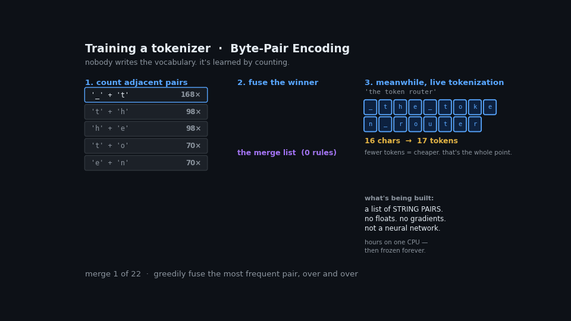
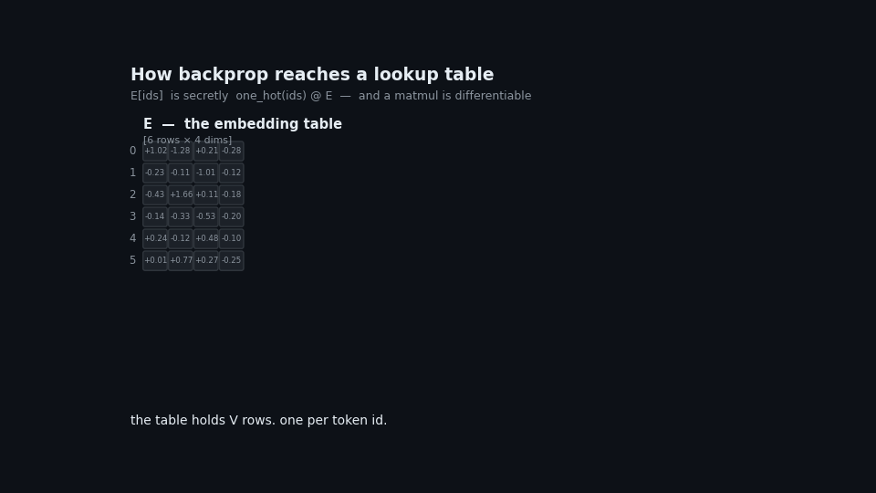
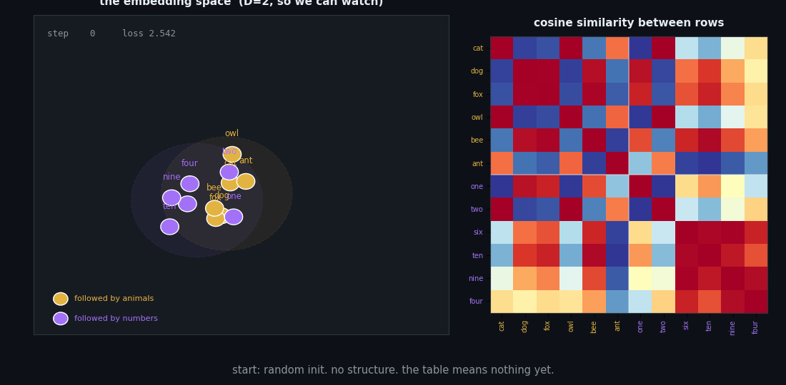

+++
title = "From Text to Vectors: How an Embedding Table Gets Trained"
date = 2026-07-16T00:10:48+08:00
slug = "from-text-to-vectors-how-an-embedding-table-gets-trained"
+++

A seam runs through every language model. Above it: billions of floats learned by gradient descent. Below it: a text file full of strings, frozen before training began, that can never change again.

That seam is where text becomes numbers. This tutorial walks through it in four parts:

1. **The tokenizer** — how it's built, and why it isn't a neural network
2. **The embedding table** — what it is, and what it isn't
3. **Backpropagation** — how a gradient reaches a lookup table at all
4. **The result** — what the table learns once it can

Every figure below came from a script that ran. The demos are deliberately tiny — twelve tokens, two dimensions — but the mechanisms are exact, not analogies.

**Prerequisites:** matrix multiplication, and the basic idea of gradient descent. No transformer knowledge assumed.

---

## Part 1 — The tokenizer



A model can't consume text. It consumes numbers. Something has to bridge that, and the bridge is the tokenizer.

A tokenizer is *trained*, but not the way a model is trained. No gradients. No loss function. The algorithm — **Byte-Pair Encoding** — is almost embarrassingly simple:

1. Break every word into characters.
2. Count every adjacent pair across the corpus.
3. Fuse the most frequent pair into a single symbol.
4. Repeat, tens of thousands of times.

Run it on a corpus about routing tokens to experts and watch what it finds:

```
merge   0: '_' + 't'     -> '_t'      (seen 204x)
merge   1: '_t' + 'h'    -> '_th'     (seen 132x)
merge   2: '_th' + 'e'   -> '_the'    (seen 132x)
...
merge  20: '_toke' + 'n' -> '_token'  (seen 48x)
```

It learned that `_the` and `_token` are units — not because anyone described English to it, and not because it understands anything. Purely because those character sequences kept appearing next to each other. **Frequency is the entire mechanism.**

### The artifact

What BPE training produces, in full:

```json
{
  "vocab":  {"_the": 24, "_token": 41, "_experts": 52, ...},
  "merges": ["_ t", "_t h", "_th e", "_t o", ...]
}
```

Strings and integers. **Zero floats.** Nothing in there could be a weight. A real `tokenizer.json` opens in a text editor and reads end to end.

The cost profile follows: hours on a single CPU box, no GPU, no gradients. It happens *before* the model exists. When it finishes, it is frozen — permanently, for the life of the model.

> **Clarification: BPE training does not produce an embedding**
>
> These are two separate training runs producing two unrelated artifacts.
>
> **BPE training** outputs a merge list — strings. Hours, one CPU.
> **The embedding** is a matrix of floats, learned later, during model pretraining. Thousands of GPUs, weeks.
>
> The only thread between them: `len(vocab)` determines the *number of rows* in the embedding table.
>
> **BPE writes the row labels. Gradient descent fills the row contents.**
>
> Scale makes the separation concrete. Llama-3's `tokenizer.json` is ~9 MB of strings. Its embedding table is ~1,050 MB of floats — **117× larger** — and every byte of it came from backprop.

### What the tokenizer is for

The compression is the point:

```
'the model routes the token'  →  26 chars  →   5 tokens
'xylophone'                   →   9 chars  →  10 tokens
```

Common text collapses. Unfamiliar text shatters back into small pieces — ultimately raw bytes, of which there are only 256, all guaranteed present in the vocabulary.

**A tokenizer cannot fail.** It can only get expensive.

That property does more work than it looks. It's what lets a fixed-size table handle unbounded input. The tokenizer is a **discretizer**: it grinds arbitrary text into a finite alphabet, so everything downstream only ever handles one of `V` known cases.

> **Clarification: `encode()` is not an "encoder"**
>
> Two unrelated things share a word.
>
> **`tokenizer.encode()`** — text → integers. An algorithm over strings, with a dictionary lookup at the end. No floats, no gradients, no matmuls. **Not a neural network.** Every model has one, including GPT, Llama, and DeepSeek.
>
> **An encoder** — a transformer stack that reads input bidirectionally (BERT, sentence-transformers). A full neural network. Decoder-only models do *not* have one.
>
> "Decoder-only" means no encoder *stack*. It does not mean no `encode()`. The tokenizer is universal.
>
> The distinguishing property is **context**. Take *"the river bank flooded"* vs *"the savings bank charged fees"*:
>
> ```
> encode()      : 'bank' → id 2 in both        ← context-blind
> nn.Embedding  : id 2 → identical vector      ← context-blind
> encoder       : → DIFFERENT vectors          ← context enters here
> ```
>
> An encoder is the stage that makes a token's vector depend on its neighbours. Everything before it is context-free plumbing.

### Why this stage is permanent

Every tokenizer quirk you've heard about traces here. Poor arithmetic because numbers split inconsistently. Non-English costing more tokens because merges were learned from an English-heavy corpus. Trailing whitespace changing outputs.

All decided before the model sees a single training example. None fixable afterward. Part 3 gives the structural reason why.

---

## Part 2 — The embedding table

The tokenizer hands over integers. The embedding turns them into vectors:

```python
x = E[ids]     # ids = [15496, 995]  →  two vectors of size d_model
```

`E` is `nn.Embedding(128256, 4096)` — a matrix with one row per token. Token ID 15496 means *"return row 15496."*

That's it. **It's a lookup, not a computation.**

> **Clarification: shape vs values**
>
> These are orthogonal, and conflating them causes most of the confusion here.
>
> ```python
> nn.Embedding(128256, 4096)
>              ^^^^^^  ^^^^
>              tokenizer   architect's choice
>              (row count) (nothing to do with the tokenizer)
> ```
>
> The tokenizer fixes only `V`. The width is your call. Train a model and watch both properties at once:
>
> ```
> step   0: E.shape = (12, 8)   row7 = [-0.130 -0.221  0.075  0.309]
> step 200: E.shape = (12, 8)   row7 = [-0.474 -0.163 -0.279 -0.402]
> step 600: E.shape = (12, 8)   row7 = [-0.540 -0.148 -0.300 -0.423]
> ```
>
> | | set by | changes during training? |
> |---|---|---|
> | row count `V` | tokenizer | **never** |
> | width `D` | architect | **never** |
> | the `V×D` floats | **backprop** | **every step** |
>
> A filing cabinet with 128,256 labeled drawers. The labels are printed permanently — drawer 41 says `_token` and always will. What goes *inside* is up to training. "Limited by the tokenizer" is true of the cabinet, not the contents.

> **Clarification: a lookup is not a projection**
>
> Compare the embedding against a genuine linear map `P: ℝ⁵ → ℝ⁶`:
>
> ```
> A REAL PROJECTION
>   P @ [0.0001, 3.7, -99, 0.5, 12]  → works
>   domain: ALL of ℝ⁵. infinite.
>   interpolates: P(½a + ½b) == ½P(a) + ½P(b)  → True
>
> THE EMBEDDING  E: {0..11} → ℝ⁶
>   E[3]   → works
>   E[12]  → IndexError: index 12 is out of bounds
>   E[3.5] → TypeError: index must be an integer
>   domain: exactly 12 legal inputs. finite. enumerable.
> ```
>
> There is no "between token 3 and token 4." The input space has **no interior**.
>
> Technically `E[ids] ≡ one_hot(ids) @ E` *is* a linear map from ℝⱽ — but you only ever feed it *corners* of that space, never the interior. It's a lookup wearing a matmul's clothes.
>
> **So which stage handles arbitrary input? The tokenizer.** That's the division of labour:
>
> ```
> arbitrary text ──[tokenizer]──→ finite ids ──[embedding]──→ points
>                  discretizer                  lookup table
> ```

> **Clarification: the values are not probabilities**
>
> A row from a trained table:
>
> ```
> E[3] = [-0.784, 0.394, 0.175, 0.925, 1.309, 0.110]
>        min -0.784 (negative), sum 2.130, values > 1
> ```
>
> Negative. Doesn't sum to 1. Unbounded. Nothing constrains it to be otherwise.
>
> Probabilities over token ids **do** exist — at the *other end* of the model:
>
> ```
> softmax(logits) = [0.200, 0.200, 0.200, 0.001, 0.200, 0.200, 0, 0, ...]
>                   all ≥ 0, sums to exactly 1.000000, length V
> ```
>
> The confusion is forgivable because of **weight tying**: `lm_head.weight = embed.weight` is standard practice, so the *same matrix* is often used in both directions. As a lookup (`E[ids]`) it yields coordinates. Transposed (`h @ E.T`) it yields logits that softmax into probabilities. Same numbers, two directions — only one produces probabilities.

---

## Part 3 — How backprop reaches a lookup table



Here's the puzzle. The embedding is indexed, not computed. Indexing is discrete. **So how does a gradient get in?**

The answer: a lookup is a matmul in disguise.

```
E[ids]  ≡  one_hot(ids) @ E
```

Indexing row 15496 is *identical* to multiplying by a vector that's 1 at position 15496 and 0 elsewhere. Nobody computes it that way — multiplying against 128,255 zeros would be absurd — but mathematically that's what it is. **And matmuls are differentiable.**

Work the backward pass and you get:

```
dE = one_hot.T @ dx
```

which collapses to *scatter `dx` back into the rows you used*. It's exact:

```python
grad_matmul  = onehot.T @ dx
grad_scatter = np.zeros_like(E)
np.add.at(grad_scatter, ids, dx)

np.allclose(grad_matmul, grad_scatter)   # True
```

That `np.add.at` line is how backprop enters the table.

### One loss, one backward pass

`E` gets gradients like any other parameter — not from a special embedding objective, but from the same next-token-prediction loss as everything else:

```
ONE loss: cross-entropy = 2.4876

  dE   norm = 0.02734    ← embedding
  dW1  norm = 0.03706    ← a layer
  dW2  norm = 0.03612    ← lm_head

after one step: loss 2.4876 → 2.4859   (all three moved together)
```

> **Clarification: there is no "embedding training" stage**
>
> The table is trained **jointly** with every other weight, in the same backward pass, from the same loss. It's rows 0..V of one blob. No separate run, no separate objective.
>
> The pipeline is not:
> ```
> BPE training → embedding training → model training     ✗
> ```
>
> It's:
> ```
> BPE training ──→ tokenizer ──┬──→ vocab_size ────────┐
>                              │                       ↓
>                              └──→ tokenized corpus → PRETRAINING
>                                                       (E, attention, FFN,
>                                                        lm_head — all at once)
> ```
>
> The tokenizer is a *prerequisite* consumed by pretraining — supplying the shape and the data — not an input transformed into an embedding.
>
> **This wasn't always true.** word2vec and GloVe (~2013) genuinely did train embeddings as standalone artifacts with their own objective, to be loaded into downstream models later. Transformers ended that era by replacing static per-word vectors with contextual ones and absorbing the input table into the model as ordinary weights.

### The boundary

There's an asymmetry in that backward pass worth staring at:

```
loss → lm_head → blocks → embedding table    ✓  gradient flows here
                              ↓
                          token IDs           ✗  STOPS. no gradient.
```

Gradients reach the **table** — it's a parameter. They never reach the **IDs** — they're integers. Discrete, not differentiable, and they're the *input*, which you don't train.

**That is the edge of the neural network.** Everything above the line is learned. Everything below it is a frozen text file from a different training run. The tokenizer sits on the far side of a boundary gradients cannot cross.

That's the structural reason it can never change.

### The sparsity that follows

One consequence falls out of the scatter-add. Feed ids `[3, 7, 1, 7]` and inspect per-row gradients:

```
row  1: |grad| = 0.013655   ← used
row  3: |grad| = 0.013548   ← used
row  7: |grad| = 0.019422   ← used TWICE, double signal
rows 0,2,4,5,6,8,10,11: exactly 0.000000
```

Only rows whose tokens appeared get updated. Everything else receives precisely nothing.

So a token's vector is learned *only* from contexts where it shows up. Rare tokens get few updates and end up near their random initialization — undertrained rows in an otherwise trained model.

This is the mechanism behind **glitch tokens**. `SolidGoldMagikarp` and its relatives were strings BPE carved out of the *tokenizer's* corpus that then barely occurred in the *pretraining* corpus. They got a row. They never got a meaning. A rare case where a nameable model failure traces directly to the seam between two training runs.

---

## Part 4 — What the table learns



The values are free to become anything. What do they become?

Here's a toy language with structure never disclosed to the model. Twelve tokens: six animals, six numbers. Animals are always followed by animals, numbers by numbers. Train a two-dimensional embedding on next-token prediction and watch.

Points start scattered at random. Nothing means anything. Then they sort themselves into two clusters, and the cosine similarity matrix develops two clean blocks on the diagonal:

```
avg cosine, animal ↔ animal : +0.180
avg cosine, number ↔ number : +0.235
avg cosine, animal ↔ number : -0.337
```

**It was never told there were two groups.** It discovered that tokens which *behave* alike should *sit* close together, because that's what made next-token prediction work. The grouping isn't an input — it's a consequence.

### Where the meaning lives

Check whether any individual dimension means something:

```
dim 0: animals avg -0.157 | numbers avg +0.207
dim 1: animals avg -0.375 | numbers avg +0.354
dim 2: animals avg +0.296 | numbers avg -0.305
```

No clean story. Dimensions aren't features you can name. `E[id][j]` is a coordinate — an unconstrained real, frequently negative, meaningless alone.

**The knowledge is in the distances, not the cells.** That's "distributed representation" stated precisely: no single number carries meaning; the arrangement does.

### Why the table isn't swappable

Two consequences follow, and together they settle a question that comes up constantly.

The vectors have **no intrinsic meaning**. Row 15496 isn't "Hello" in some universal coordinate system. It's whatever arbitrary point in 4096-dim space *this particular model's layers co-evolved to interpret* as "Hello." The coordinate system is private to one network.

So dropping in a different table doesn't change behavior — it produces noise. Every downstream weight is reading a language it never learned. Less like swapping a dictionary; more like rewiring which letters your keyboard emits, then wondering why muscle memory outputs garbage.

> **Clarification: RAG embedders *are* swappable — LLM tables aren't**
>
> A RAG embedder is a **standalone model**. Its output vectors live in a vector DB, external to any LLM. Swap sentence-transformers for `text-embedding-3`, re-index, done. It works because nothing downstream is coupled to that coordinate system.
>
> Inside an LLM there is no separate embedding model. There's a lookup table, trained jointly with everything else, whose coordinate system exists only in relation to the layers above it.
>
> Same word — "embedding" — two very different objects.

---

## What you *can* do

The instinct to intervene at the embedding layer is right. It's the *operation* that needs adjusting: you can't **substitute** the table, but you can **add to** it.

### Soft prompts

Prepend learned continuous vectors to your prompt's embedding sequence. They correspond to no token. Freeze the entire model, train only those few vectors. This genuinely steers behavior for a few thousand parameters.

What makes it possible is worth appreciating. You can't interpolate the *inputs* — there's no token between 3 and 4, and `E[3.5]` is a `TypeError`. But you can average the *outputs*:

```
0.5*E[3] + 0.5*E[4]  →  a perfectly valid point in ℝᴰ
                         corresponding to no token at all
```

The space is continuous and dense. Only `V` of its points have names.

**Everything else is reachable — you just can't get there by typing.**

### Vocabulary extension

Adding tokens for a new language or domain jargon means resizing the table and training the new rows while old ones stay put. Standard practice when adapting a base model.

### Steering vectors

Add a direction to the residual stream. Usually applied at a middle layer rather than the input, since concepts are more linearly represented there.

The pattern: **extend and steer, don't substitute.** Meaning lives in the relationship between the table and the layers above it — never in the table alone.

---

## The whole chain

```
raw text
  ↓  tokenizer          frozen text file. no floats. hours on a CPU.
token ids                ← gradients stop here. edge of the network.
  ↓  E[ids]             lookup ≡ one_hot @ E. differentiable w.r.t. E.
vectors                  learned coordinates. meaning is in the geometry.
  ↓  transformer blocks  attention mixes across tokens; FFN per token
  ↓  lm_head             often the SAME matrix as E, used backwards
softmax                  ← NOW you have probabilities over token ids
  ↓
next token
```

Two artifacts. Two training runs. One seam.

The tokenizer is a frozen text file with no floats in it. Everything downstream is one blob of weights learning from one loss — including the embedding, which is special only in that its backward pass is a scatter instead of a matmul.

Knowing where that seam runs explains a surprising amount: why tokenizer quirks are permanent, why glitch tokens exist, why RAG embedders swap and LLM tables don't, and why soft prompts work at all.

---

## Appendix: reproducing this

Each animation is generated by a script that trains the model it depicts. Nothing is hand-animated.

| script | output |
|---|---|
| `anim1.py` | BPE merge loop, recorded step by step |
| `anim2.py` | one-hot equivalence, forward gather and backward scatter |
| `anim3.py` | a real 2D embedding trained with manual backprop |

Notes on the toy in Part 4: twelve tokens, `D=2`, 900 steps of manual SGD. Loss goes 2.542 → 1.733 against a theoretical floor of `ln(5) ≈ 1.609` — each token has five equally-likely successors, so that's near-converged, not a bug.
