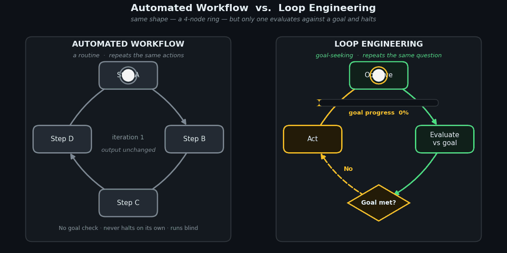

+++
title = "From Agentic Programming to Loop Engineering"
date = 2026-07-10T22:07:05+08:00
slug = "loop-is-goal-seeking-not-routine"

[taxonomies]
tags = ["agentic-ai", "loop-engineering", "coding-agents", "orchestration"]
+++

## The shift in one sentence

Loop engineering is the move from *prompting* an AI agent by hand to *designing the system that prompts it for you*. The leverage stops living in the quality of a single prompt and moves into the design of the wrapper that generates prompts, checks the result, and decides whether to run again.

The term crystallized in the second week of June 2026, off a couple of widely-shared posts. The one people keep quoting is Boris Cherny, creator of Claude Code at Anthropic:

> I don't prompt Claude anymore. I have loops that are running. They're the ones that are prompting Claude and figuring out what to do. My job is to write loops.

That single reframing — *my job is to write loops* — is the whole idea. You stop being the conversationalist inside the turn-by-turn exchange and become the person who builds the runtime that runs the exchange without you.

## A common misconception: "loop = a well-defined, harnessed automated flow"

A natural first read of the word is that a "loop" is just an automated flow — take agentic programming, make it repeatable, wrap it in a harness, done. That captures something real, but it undersells the actual claim in two ways.

**First, it misses the inversion of control.** The point isn't that the flow is automated; it's that the *author of the prompts changes*. The agent isn't waiting for your next message — the loop is. You supply a goal once, and the machinery iterates.

**Second, "harnessed" is borrowed from the layer below.** The community frames loop engineering as the fourth rung in a lineage:

> prompt engineering → context engineering → harness engineering → loop engineering

Harness engineering is its own prior step: the harness is the tool surface, the sandbox, the scaffolding the agent acts *through*. "Well-defined and harnessed" is a precondition you inherit from that layer. Loop engineering sits *above* it and adds three things the harness doesn't have: a **trigger**, a **verifiable goal**, and — the part that's actually hard — the **guardrails that decide when to stop**.

## Anatomy of an agentic loop

Stripped down, a loop needs only two ingredients:

- **A trigger** — something that starts it (a PR opening, a schedule, a human saying "go").
- **A verifiable goal** — a defined end state the agent works toward (all tests pass, CI green, a `/goal` condition graded by a separate model).

Given those, the agent runs a cycle:

1. **Observe** the current state (read files, run a test, take a screenshot).
2. **Evaluate** the result against the goal.
3. **Decide** — continue, stop because it succeeded, or stop because it's blocked or out of budget.
4. **Act** — take one bounded step, then observe again.

It keeps going until the goal is met or a stopping condition fires. You give it a goal, not a prompt.

## The real work is on the *stopping* side

Here's the counterintuitive part: the repetition scaffolding is trivial — it's a `while` loop, one line any programmer can write. The engineering is almost entirely in halting well. The canonical production failures are not edge cases:

- **Infinite loops** — the loop never satisfies its exit condition.
- **Goal drift** — the target quietly mutates across iterations until the agent is solving the wrong problem.
- **Token-cost explosions** — an unbounded loop burns budget with nothing to show.
- **Mode collapse / "spinning"** — a loop that retries the same action after the same error isn't learning; it's spinning.

As one field guide put it: the production version of the job is that you write the loops, and most of your work is making sure they halt.

## The archetype: Ralph, productized

Everyone traces the pattern back to the **Ralph loop**. Ralph sidesteps context rot by making every iteration a *fresh* agent with a clean context that reads the current repo state and task list from disk, does exactly one unit of work, commits, and exits. The intelligence doesn't live in one heroic run — it lives in clear, granular specs and verifiable outcomes applied over and over against an external memory the model can't pollute.

A tidy way to describe the current state of the art:

> Loop engineering is Ralph, productized.

The `while` loop becomes a scheduled automation, the context reset becomes a worktree plus a sub-agent, and the `ALL TASKS DONE` grep becomes a `/goal` condition graded by a *separate* model. Same shape, fewer sharp edges. That last detail — the grader being a different model from the generator — is the familiar **critic-must-not-equal-generator** principle, now baked into the loop's exit condition.

## The core distinction: goal-seeking, not routine

So can we conclude the "loop" is not a routine but a process of goal-seeking? **Yes — with one refinement that makes the conclusion stronger, not weaker.**

A loop is *implemented as* a routine but is not *essentially* one. The word borrows from control flow — there's a literal `while` underneath — but that repetition is the dumb, deterministic part. The substance is the goal-seeking: observe, evaluate against a verifiable goal, decide, halt or continue.

The cleanest way to state the difference:

> A routine repeats the same **actions**. A loop repeats the same **question**.

The actions differ every iteration — different file, different fix, different test — but the question is constant: *"Is the goal met, and if not, what's the best next move?"* A cron job or an RPA script is a genuine routine: fixed steps, no evaluation, no adaptation. If the environment shifts, it either breaks or blindly repeats. The agentic loop is defined precisely by *not* being that.

And here's what vindicates the framing hardest: **when a loop degenerates into a routine, that's the bug.** "Spinning" and mode collapse are exactly the case where the loop stops asking the question and just repeats an action. Collapsing into a fixed routine is the canonical *failure* of loop engineering — not its definition.

So the sharpest conclusion isn't merely "loop = goal-seeking, not routine." It's that **goal-seeking and routine are the two poles**, and loop engineering is the discipline of keeping the process pinned to the goal-seeking pole — via the verifiable goal and the halt conditions — so it never decays into a spinning routine on one side or an unbounded wander on the other. The routine is what you get when the loop stops thinking; the goal is what keeps it a loop.

## Where this meets a real orchestration stack

Most of the current writing implicitly assumes a *single* cloud coding agent (Claude Code, Codex) driving the loop. But the pattern generalizes cleanly to formal orchestration and heterogeneous fleets:

- **Escalation ladders, hard retry ceilings, and human gates** at requirements / architecture / pre-merge *are* the halt conditions and guardrails the blog discourse is now naming. A Temporal-style workflow is loop engineering with a rigorous orchestrator underneath — the opposite end of the rigor spectrum from a `while true` + `grep`, but the same shape.
- **Heterogeneous fleets** sharpen the "who prompts whom" inversion: when the loop *driver* and the loop *workers* are different models on different silicon (e.g. a strong orchestrator model dispatching to local executor models), the halt-condition grading may want to live on a specific tier — and the critic-must-not-equal-generator rule can be enforced at the *hardware* level, not just the prompt level.
- The academic framing (see the arXiv paper *Agentic Software Engineering: Foundational Pillars and a Research Roadmap*, 2509.06216) proposes **Agentic Loop Engineering (ALE)** as disciplined, DevOps-lineage orchestration — a declarative `LoopScript` producing a "Merge-Readiness Pack." It's a useful vocabulary for anyone already hand-rolling this in a workflow engine.

## TL;DR

- **Loop engineering** = designing the system that prompts, checks, remembers, and re-runs an agent — instead of typing each instruction yourself.
- It's the **fourth layer**: prompt → context → harness → loop. "Harnessed and automated" is a precondition it inherits, not what makes it a loop.
- A loop = **trigger + verifiable goal + iteration + halt conditions**. The hard engineering is the halting.
- The "loop" is **goal-seeking, not routine**. A routine repeats actions; a loop repeats a question. When it collapses back into a routine ("spinning"), that's the failure mode — which is exactly why the goal-seeking reading is the right one.

---

*Written from a working conversation, July 2026. Sources for the June 2026 framing include commentary from Boris Cherny (Claude Code), the Ralph loop pattern, and the arXiv "Agentic Software Engineering" roadmap (2509.06216).*
