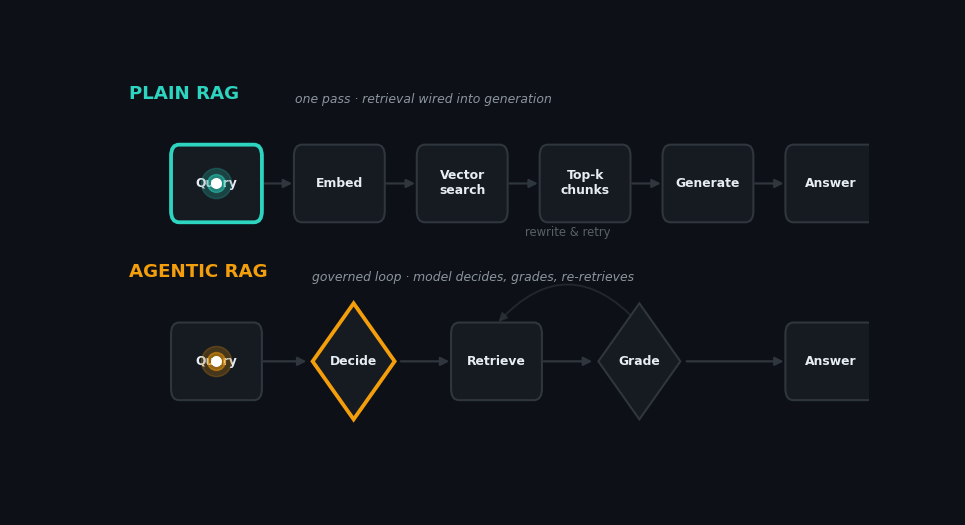

+++
title = "Plain RAG vs. Agentic RAG: It's the Control Flow, Not the Plumbing"
date = 2026-07-10T21:08:38+08:00
slug = "plain-rag-vs-agentic-rag-it-s-the-control-flow-not-the-plumbing"

[taxonomies]
tags = ["rag", "agents", "llm"]
+++

Retrieval-Augmented Generation gets discussed as if "RAG" and "agentic RAG" were two different architectures. They mostly aren't. They're two different *control flows* over the same parts. Getting that distinction right changes how you build, and — as we'll see — it means the same retrieval tool can be plain RAG one day and agentic RAG the next, with nothing changed but the loop around it.

## Plain RAG: retrieval wired into generation

Plain RAG is a linear, one-shot pipeline:

> query → embed → vector search → top-k chunks → generate → answer

The retrieval step is deterministic and happens exactly once, orchestrated by *your* code rather than by the model. The LLM never decides whether to retrieve, what to retrieve, or whether what came back was any good. It consumes whatever the pipeline hands it and composes an answer.

Two things are worth stating precisely, because the casual mental model ("similarity fetches the relevant content, the model just stitches it together") oversells both halves.

First, vector search returns **semantic proximity in embedding space** — nearest neighbours by cosine or dot-product. That is *not* the same thing as relevance. Chunks can sit close to the query vector and still be useless, and the genuinely relevant chunk can fall just outside your top-k. Similarity is a lossy proxy for "actually answers the question." What you retrieve is *plausibly related* content, not guaranteed-relevant content.

Second, the model is doing more than concatenation. It reads the retrieved chunks as grounding, resolves conflicts between them, decides what to ignore, and synthesises. But the intuition underneath is correct and important: in plain RAG the **retrieval is dumb and the generation is where the intelligence sits**. That asymmetry is the whole reason the agentic variant exists.

## Agentic RAG: retrieval governed by generation

Agentic RAG promotes retrieval from a fixed pipeline stage to a **tool the model invokes inside a reasoning loop**. Now the model exercises judgment over retrieval. It can:

- decide whether retrieval is needed at all,
- decompose a complex question into sub-queries (multi-hop),
- rewrite a query that returned weak results and try again,
- route between multiple sources — a vector store, SQL, a graph index, the web,
- and — the crucial one — **grade what came back and re-retrieve** before committing to an answer.

This is the family that includes patterns like corrective RAG and self-RAG: the model checks its own grounding and corrects course. In the animation above, that's the amber loop — the pulse reaches *Grade*, judges the evidence thin, and arcs back to *Retrieve* to rewrite and try again, twice, before it finally answers. The plain-RAG pulse, meanwhile, has long since finished and is just waiting.

## The comparison

| Dimension | Plain RAG | Agentic RAG |
|---|---|---|
| Control flow | Static pipeline (fixed DAG) | Dynamic, model-driven loop |
| Who orchestrates | Your code | The model |
| Query handling | Single embedded query | Decomposition, multi-hop, rewriting |
| Sources | Usually one vector store | Many tools, routed between |
| Self-correction | None | Grading + re-retrieval |
| Cost & latency | Low, predictable | Higher, variable |
| Best for | Straightforward lookup | Ambiguous or multi-hop queries, heterogeneous corpora |

A one-line way to hold it: **plain RAG is retrieval *wired into* generation; agentic RAG is retrieval *governed by* generation.** The tradeoff is exactly what you'd expect — robustness on hard queries in exchange for determinism, latency, and token spend. For a lot of everyday lookup workloads, plain RAG is still the right call. The agentic layer earns its cost when queries genuinely need planning or the corpus is heterogeneous.

## Building RAG as an MCP tool

A natural instinct is to expose retrieval as an MCP tool — something like `search_knowledge_base(query, k, filters)` returning ranked chunks with metadata — and let an agent call it. This is arguably the cleanest way to express agentic RAG, because it *is* the "retrieval as a tool the model governs" pattern made concrete.

But here's the subtlety that trips people up: **the transport doesn't determine the category — the control flow does.**

If the agent calls the retrieval tool once, takes whatever comes back, and composes it into an answer, that's plain RAG. It's plain RAG that happens to be *plumbed through* MCP. Wrapping retrieval in a tool interface doesn't make it agentic. The loop still collapses to a straight line — call → compose — the same shape as query → search → generate, just with an MCP hop in the middle.

Agentic-ness is a property of the **trajectory**, not the architecture. The very same MCP tool behaves either way depending on what the agent does with it:

- Always calls it once, regardless of the query, never re-examines → **plain RAG**.
- Decides per-query whether to call it, rewrites and re-calls on weak results, routes between tools, grades before answering → **agentic RAG**.

So you can ship one `search_knowledge_base` tool and have it be "normal RAG" on Monday and "agentic RAG" on Tuesday, purely by changing the orchestration prompt and the loop around it. The tool is identical; the behaviour is what moves it across the line.

### Design notes if you go the MCP route

- **The tool description is the contract.** In MCP, the tool description is *runtime model input*, not just documentation — it's what the agent reads to decide when to call the tool and how to phrase the query. A vague description means the agent retrieves at the wrong times, or collapses to a single blind call. This is the highest-leverage thing to get right. If your intent is agentic behaviour but the agent keeps doing one unconditional call, that's usually a description-or-prompt problem, not an architecture problem: the model wasn't given the signal (or the permission) to retrieve conditionally, rewrite, and re-check.
- **Return structure matters more than in plain RAG.** Because the agent may re-retrieve, return scores, source IDs, and chunk provenance — not just concatenated text — so the model can grade relevance and decide whether to go again.
- **Granularity is a real fork.** One generic `search` tool vs. several typed tools (`search_code`, `search_docs`, `search_graph`) is a genuine design decision. Multiple typed tools hand the agent a routing signal for free; a single generic tool pushes that routing logic into the query. If you have more than one retrieval *primitive* — say embedding similarity **and** a graph-expansion method like Personalized PageRank — exposing them as separate tools lets the agent do a "seed then expand" pattern: similarity to find entry points, graph expansion to grow the neighbourhood. Neither primitive does that alone, and the agent combining them is exactly the kind of judgment that makes RAG agentic.

## Takeaway

Don't reach for "agentic RAG" because it sounds more capable. Reach for it when the *trajectory* your queries need — conditional retrieval, rewriting, grading, multi-source routing — actually justifies the extra round-trips. If a single retrieval pass answers the question, a single retrieval pass is the correct design, MCP tool or not. The intelligence you're paying for in agentic RAG isn't the retrieval; it's the model *deciding how to retrieve*.
